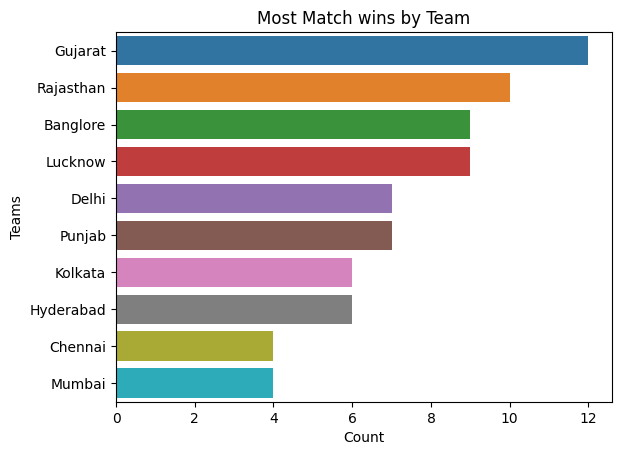
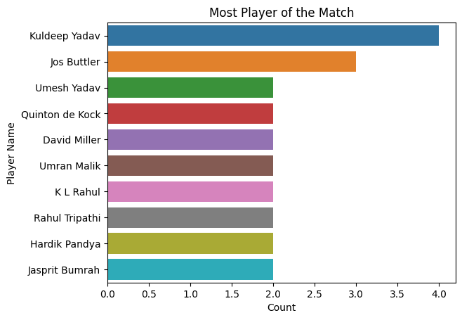
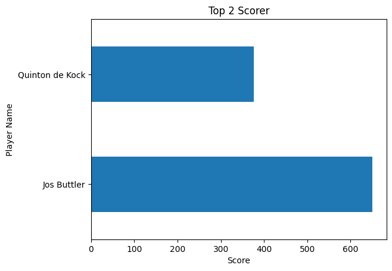
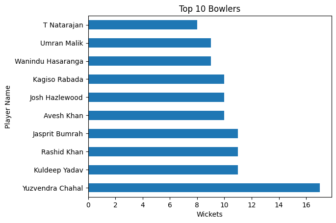

# IPL Data Analysis (2022)

## Overview  
The IPL Data Analysis project explores match data to identify patterns in team performance, player contributions, and match outcomes. The goal is to transform raw cricket data into meaningful insights using data analysis and visualization techniques.

## Dataset  
The dataset contains IPL match records including:

- Team names and match details  
- Toss winner and decision  
- Scores, wickets, and match results  
- Player of the match  
- Top scorer and best bowler  
- Venue information  

## Tools & Technologies  
- Python  
- Pandas  
- NumPy  
- Matplotlib  
- Seaborn
- Jupyter Notebook  

## Project Workflow  
- Imported dataset using Pandas  
- Performed data cleaning and preprocessing  
- Handled missing values and formatted data  
- Conducted exploratory data analysis (EDA)  
- Created visualizations using Matplotlib and Seaborn  

## Key Insights  
- Analyzed team performance across seasons  
- Studied impact of toss on match results  
- Identified top-performing players  
- Observed scoring and wicket trends  
- Compared team statistics  

## Outcome  
This project demonstrates:

- Data cleaning and preprocessing  
- Exploratory data analysis (EDA)  
- Data visualization techniques  
- Insight generation from sports data  

## Visualizations  

* **Most Match Wins by Team**  

* **Most Player of the Match**  

* **Top 2 Scorer**  

* **Top 10 Bowlers**  

